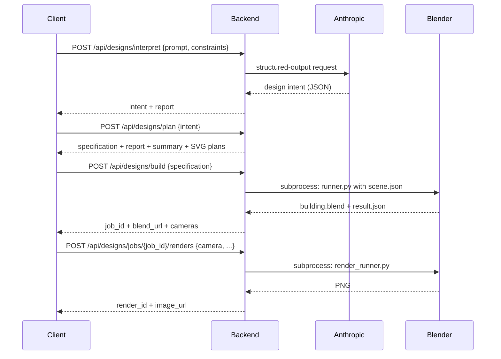

# AI Architect Agent - API Documentation

This document describes every endpoint of the backend API as implemented. For installation see [Installation Guide](INSTRUCTION.md); for how the parts fit together see [Architecture](ARCHITECTURE.md); for security implications see [Security](SECURITY.md).

The running backend also publishes an interactive OpenAPI description at `/api/docs` (Swagger UI) and the raw schema at `/api/openapi.json`; those are generated from the same code and are authoritative if this document and the code ever disagree.

---

## 1. API Overview

| Aspect | Value |
| --- | --- |
| Framework | FastAPI, with Pydantic v2 models for every request and response |
| Format | JSON in and out, except the `.blend` and `.png` downloads |
| Prefix | Every route starts with `/api` |
| Request IDs | Every response carries an `X-Request-ID` header; send your own (letters and digits, up to 64 characters) to correlate logs |
| Body size limit | 1 MB by default (`MAX_REQUEST_BYTES`); larger bodies get `413 request_too_large` |
| Style | Each step of the pipeline is a separate, synchronous request: interpret, plan, build, render. There are no background jobs or status-polling endpoints |

## 2. Base URL

| Situation | Base URL |
| --- | --- |
| Backend directly (development) | `http://127.0.0.1:8000` |
| Through the Vite development server | `http://localhost:5173` (it forwards `/api/*` to the backend) |

## 3. Authentication

**The backend API does not implement authentication.** Any client that can reach it can call every endpoint. It is designed to run on your own machine, bound to `127.0.0.1`. See [Security](SECURITY.md#13-api-security) before exposing it anywhere else.

This is separate from **Anthropic authentication**: the backend authenticates to Anthropic with `ANTHROPIC_API_KEY` from `.env`. Clients never send, receive or need that key.

## 4. Endpoint Summary

| Method | Endpoint | Purpose |
| --- | --- | --- |
| `GET` | `/api/health` | Backend status, version, Claude key and verification state, Blender detection |
| `GET` | `/api/health/claude` | Prove Anthropic accepts requests (cached for 10 minutes) |
| `GET` | `/api/specifications/schema` | JSON Schema of `BuildingSpecification` |
| `POST` | `/api/specifications/validate` | Validate a specification; returns the report, safe fixes and a summary |
| `GET` | `/api/examples` | List the example briefs |
| `GET` | `/api/examples/{example_id}` | One example brief and its specification |
| `POST` | `/api/designs/interpret` | Brief -> design intent (calls Claude) |
| `POST` | `/api/designs/plan` | Design intent -> specification, report and floor plans |
| `POST` | `/api/designs/build` | Specification -> Blender build job |
| `GET` | `/api/designs/jobs/{job_id}/building.blend` | Download a built model |
| `POST` | `/api/designs/jobs/{job_id}/renders` | Render one image of a built model |
| `GET` | `/api/designs/jobs/{job_id}/renders/{render_id}.png` | Download a render |
| `POST` | `/api/designs/modify` | Apply a plain-English change to a design (calls Claude) |
| `GET` | `/api/projects` | List saved projects |
| `POST` | `/api/projects` | Save a new project |
| `GET` | `/api/projects/{project_id}` | Open a saved project |
| `PUT` | `/api/projects/{project_id}` | Save a project again |
| `DELETE` | `/api/projects/{project_id}` | Delete a saved project |

## 5. Endpoint Documentation

### GET /api/health

**Purpose.** Report that the API is up and how it is configured. It never calls Anthropic and never returns the key.

**Response 200**

```json
{
  "status": "ok",
  "service": "AI Architect Agent",
  "version": "1.0.0rc1",
  "environment": "development",
  "timestamp": "2026-10-06T09:00:00Z",
  "checks": {
    "anthropic": {
      "configured": true,
      "model": "claude-sonnet-5-5",
      "verification": { "status": "not_checked", "structured_outputs": "not_checked", "code": null, "message": null, "checked_at": null }
    },
    "blender": { "status": "found", "detail": "Blender executable found." }
  }
}
```

`checks.blender.status` is `found`, `not_configured` or `missing`. `verification` repeats the last result of `GET /api/health/claude` while it is less than 10 minutes old.

### GET /api/health/claude

**Purpose.** Show whether Anthropic actually accepts requests: a tiny text request (key, credit, model, network) followed by a tiny structured-output request. Costs a fraction of a cent.

**Query parameters**

| Name | Type | Default | Description |
| --- | --- | --- | --- |
| `refresh` | boolean | `false` | Check again even if a result less than 10 minutes old exists |

**Response 200**

```json
{ "status": "verified", "structured_outputs": "ok", "code": null, "message": null, "checked_at": "2026-10-06T09:00:00Z" }
```

A failed check is still `200`, with `status: "failed"`, the error `code` (for example `CLAUDE_BILLING_ERROR`) and a safe `message`.

**Errors:** `503 anthropic_key_missing`.

### GET /api/specifications/schema

**Purpose.** The JSON Schema of `BuildingSpecification`, for tools that produce or check specifications. **Response 200:** a JSON Schema document.

### POST /api/specifications/validate

**Purpose.** Validate any specification without building it.

**Request body:** a `BuildingSpecification` as JSON (see [section 10](#10-architectural-specification-schema)). Malformed specifications are not rejected with `422`; they come back as validation issues.

**Response 200**

| Field | Type | Description |
| --- | --- | --- |
| `report` | ValidationReport | `status` (`PASS`, `WARNING`, `ERROR`), counts, `issues`, `fixes` |
| `specification` | BuildingSpecification or null | The specification after safe automatic fixes, if it could be parsed |
| `summary` | SpecificationSummary or null | Floors, size, rooms, roof and so on |

### GET /api/examples

**Purpose.** List the example briefs in `examples/`. **Response 200:** `[{"id": "british-family-house", "title": "...", "prompt": "..."}, ...]`

### GET /api/examples/{example_id}

**Path parameters:** `example_id`, a lowercase slug such as `scandinavian-house`.

**Response 200:** `{"id", "title", "prompt", "specification"}`.

**Errors:** `400 invalid_example_id` (not a plain slug), `404 example_not_found`, `500 example_unreadable`.

### POST /api/designs/interpret

**Purpose.** Stage 1: Claude turns a brief into a validated design intent. Described in detail in [section 6](#6-generation-api).

### POST /api/designs/plan

**Purpose.** Stages 2 to 4: the deterministic planner turns a design intent into a `BuildingSpecification` and SVG floor plans. Does not call Claude.

### POST /api/designs/build

**Purpose.** Stages 5 to 9: Blender builds the specification. Requires `BLENDER_EXECUTABLE`.

### GET /api/designs/jobs/{job_id}/building.blend

**Purpose.** Download the model a build produced.

**Path parameters:** `job_id`, 32 lowercase hexadecimal characters.

**Response 200:** the `.blend` file (`application/x-blender`). **Errors:** `404 job_not_found`.

### POST /api/designs/jobs/{job_id}/renders

**Purpose.** Stage 10: render one image of a built model.

### GET /api/designs/jobs/{job_id}/renders/{render_id}.png

**Purpose.** Download a render. Both IDs are 32 lowercase hexadecimal characters.

**Response 200:** `image/png`. **Errors:** `404 render_not_found`. This endpoint does not need Blender to be configured.

### POST /api/designs/modify

**Purpose.** Apply a plain-English change to an existing design. Described in [section 6](#6-generation-api).

### Project endpoints

Described in [section 7](#7-project-api).

## 6. Generation API

A complete generation is four requests. The client keeps the state between them: the intent from step 1, the specification from step 2 and the job ID from step 3.



### Interpret: POST /api/designs/interpret

**Request body**

| Field | Type | Required | Description |
| --- | --- | --- | --- |
| `prompt` | string | Yes | The brief, 10 to 4,000 characters |
| `constraints` | DesignConstraints | No | Advanced options; each one overrides the brief |

`DesignConstraints` (every field optional): `building_type`, `style`, `floors` (1 to 10), `width`, `depth`, `height`, `bedrooms`, `bathrooms`, `garage`, `roof`, `detail_level`.

**Response 200: InterpretationResult**

| Field | Type | Description |
| --- | --- | --- |
| `intent` | DesignIntent | The validated design intent ([section 9](#9-data-models)) |
| `report` | ValidationReport | Checks on the intent |
| `constraints_applied` | list of strings | Which advanced options overrode Claude |
| `attempts` | integer | Claude calls used: 1, or 2 if a correction was needed |
| `model` | string | The model that replied |
| `usage` | object | `input_tokens`, `output_tokens`, `cache_read_input_tokens` |
| `completed_stages` | list of strings | `["understanding_request"]` |

**Errors:** `503 anthropic_key_missing`; every `CLAUDE_*` code ([section 11](#11-error-responses)); `422 not_a_building_request`, `422 design_request_refused`, `422 design_interpretation_failed` (Claude's reply failed validation twice; `issues` lists why), `502 claude_response_truncated`.

### Plan: POST /api/designs/plan

**Request body:** `{"intent": DesignIntent}`.

**Response 200: PlanResponse**

| Field | Type | Description |
| --- | --- | --- |
| `specification` | BuildingSpecification | The planned building |
| `report` | ValidationReport | Validation of the planned building |
| `summary` | SpecificationSummary | Floors, footprint, areas, bedrooms, bathrooms, garage, roof |
| `notes` | list of strings | How the plan differs from the intent, and why |
| `plans` | list of `{level, name, svg}` | One SVG floor plan per floor |
| `completed_stages` | list of strings | `["creating_specification", "validating_design", "planning_rooms"]` |

**Errors:** `422 planning_failed` (with the reason), `422 building_validation_failed`.

### Build: POST /api/designs/build

**Request body:** `{"specification": BuildingSpecification}`. The specification is validated again; one with errors is refused.

**Response 200: BuildResponse**

| Field | Type | Description |
| --- | --- | --- |
| `job_id` | string | 32 hexadecimal characters; names the job folder |
| `blend_url` | string | `/api/designs/jobs/{job_id}/building.blend` |
| `cameras` | list of `{name, role}` | Every camera created, for example `Camera_Exterior_Front` / `exterior_front` |
| `blender_version` | string | The Blender that built it |
| `object_count` | integer | Objects built |
| `duration_seconds` | number | Build time inside Blender |
| `completed_stages` | list of strings | `preparing_scene`, `applying_materials`, `generating_geometry`, `creating_lighting`, `creating_cameras` |

**Errors:** `503 blender_unavailable`, `502 blender_build_failed`, `504 blender_timeout`, `422 building_validation_failed`.

### Render: POST /api/designs/jobs/{job_id}/renders

**Request body: RenderRequest** (every field optional)

| Field | Values | Default |
| --- | --- | --- |
| `camera` | Any name from the build's `cameras` | `Camera_Exterior_Front` |
| `preset` | `day`, `evening` | `day` |
| `quality` | `preview` (16 samples, half size), `standard` (64), `high` (256 Cycles / 128 EEVEE) | `preview` |
| `resolution` | `1280x720`, `1920x1080`, `2560x1440` | `1280x720` |
| `engine` | `auto`, `eevee`, `cycles`, or omitted for `RENDER_DEFAULT_ENGINE` | server default |

**Response 200: RenderResponse:** `render_id`, `image_url`, `camera`, `role`, `preset`, `quality`, `engine` (the engine actually used), `width`, `height`, `duration_seconds`, `note` (why Cycles was used when `auto` did not pick EEVEE), `completed_stages: ["rendering"]`.

**Errors:** `404 job_not_found`, `422 unknown_camera` (with the list of `cameras`), `503 blender_unavailable`, `502 render_failed`, `504 render_timeout`, `422 invalid_request` for values outside the lists above.

### Modify: POST /api/designs/modify

**Request body: ModifyRequest**

| Field | Type | Required | Description |
| --- | --- | --- | --- |
| `request` | string | Yes | The change, 3 to 1,000 characters |
| `intent` | DesignIntent | Yes | The current design intent |
| `overrides` | list of `{op, params}` | No | Finishing changes made so far (returned by previous calls) |
| `specification` | BuildingSpecification | Yes | The current specification |

**Response 200: ModifyResponse:** the new `intent`, `overrides`, `specification`, `report`, `summary` and `plans`, plus `change_summary` (Claude's), `changes` (computed by comparing the specifications, for example `"Roof: gable 35° slate -> hip 35° slate."`), `assumptions`, `notes`, `attempts` and `model`.

**Errors:** `503 anthropic_key_missing`, every `CLAUDE_*` code, `422 not_a_modification`, `422 modification_refused`, `422 modification_failed` (with `problems`).

## 7. Project API

Projects are JSON files under `output/projects/` (see [Architecture](ARCHITECTURE.md#15-project-storage)). There is no database.

### GET /api/projects

**Response 200:** newest first.

| Field | Type | Description |
| --- | --- | --- |
| `id` | string | 32 hexadecimal characters |
| `name` | string | Project name |
| `version` | integer | Increases with every save |
| `updated_at` | datetime | Last save |
| `floors`, `bedrooms`, `changes` | integer | Summary and number of changes |
| `thumbnail_url` | string or null | The most recent render that still exists |

### POST /api/projects

**Request body: ProjectData**

| Field | Type | Required | Description |
| --- | --- | --- | --- |
| `name` | string | Yes | 1 to 120 characters |
| `brief` | string | Yes | The original brief, up to 4,000 characters |
| `constraints` | DesignConstraints | No | Advanced options used |
| `interpretation` | InterpretationResult | Yes | From `/interpret` |
| `intent` | DesignIntent | Yes | The current intent |
| `overrides` | list | No | Finishing changes |
| `specification` | BuildingSpecification | Yes | The current specification |
| `notes` | list of strings | No | Planner notes |
| `history` | list of `{request, summary, changes, assumptions}` | No | Changes made |
| `build` | `{job_id, blender_version, object_count, cameras}` or null | No | The latest build |
| `renders` | list of `{render_id, job_id, camera, preset, quality, engine, width, height, note}` | No | Its renders |

Unknown fields are rejected with `422`. The client never sends paths, URLs or a validation report: the server derives every path and URL from the IDs and stores its own validation of the specification.

**Response 201:** the stored project (below).

### GET /api/projects/{project_id}

**Response 200:** the stored project: everything above plus `id`, `version`, `created_at`, `updated_at`, `schema_version`, the server's `report`, `build` and `renders` with `blend_url`/`image_url`, repository-relative paths and `available` (whether the file still exists), and the derived `summary` and `plans`.

**Errors:** `404 project_not_found` (also for IDs that are not 32 hexadecimal characters), `500 project_unreadable` (damaged file).

### PUT /api/projects/{project_id}

**Request body:** `ProjectData` plus `version`, the version you opened. **Response 200:** the stored project with `version` increased by one.

**Errors:** `409 project_changed` (saved elsewhere since; `current_version` says which), `404 project_not_found`.

### DELETE /api/projects/{project_id}

**Response 204** with no body. The project file is deleted; its build and render files in `output/jobs/` are kept. **Errors:** `404 project_not_found`.

## 8. Health/System API

| Question | Where |
| --- | --- |
| Is the backend up, which version, which environment? | `GET /api/health`: `status`, `version`, `environment` |
| Is a Claude key configured, which model? | `GET /api/health`: `checks.anthropic.configured`, `.model` |
| Does Anthropic accept requests and structured output? | `GET /api/health/claude` |
| Is Blender found? | `GET /api/health`: `checks.blender` (checks the path only; it does not start Blender) |

## 9. Data Models

### DesignIntent (Claude's output)

| Field | Type | Description |
| --- | --- | --- |
| `understood` | boolean | `false` if the brief is not a building request |
| `project_name`, `summary` | string | Name and one-paragraph summary |
| `building_type`, `style` | string | For example `detached_house`, `contemporary` |
| `floors` | integer | 1 to 10 |
| `floor_height` | number | Floor-to-floor height in metres |
| `footprint_width`, `footprint_depth` | number | Target footprint in metres |
| `entrance_room` | string | ID of the room with the front door |
| `rooms` | list of IntentRoom | ID, name, type, floor, target area, glazing, preferred side |
| `connections` | list | Which rooms connect, by door or opening |
| `stairs` | list | Stair start and arrival rooms |
| `roof` | object | Type (`flat`, `gable`, `hip`, `shed`), pitch, material |
| `exterior` | object | Wall, accent and window-frame materials |
| `site` | object | Driveway, paths, patio, planting, balcony rooms |
| `assumptions` | list of strings | What Claude assumed |

### ValidationReport

| Field | Type | Description |
| --- | --- | --- |
| `status` | string | `PASS`, `WARNING` or `ERROR` |
| `error_count`, `warning_count` | integer | Counts |
| `issues` | list | `severity`, `code`, `message`, `element_ids`, `location` |
| `fixes` | list | Safe automatic fixes applied: `code`, `message`, `element_ids` |

## 10. Architectural Specification Schema

`BuildingSpecification` (schema version `1.0`) is the single source of truth for a building. Units are metres; the origin is the front-left corner at ground level, X along the front, Y towards the rear, Z up. The full schema is served by `GET /api/specifications/schema`; the fields are documented in [docs/building-specification.md](docs/building-specification.md).

| Field | Required | Contents |
| --- | --- | --- |
| `schema_version` | No (default `1.0`) | Version of the format |
| `project` | Yes | Name and description |
| `building` | Yes | Type, style, footprint, wall and slab thicknesses, foundation height |
| `floors` | Yes | Level, name, elevation and height of each floor |
| `rooms` | Yes | ID, name, type (19 types), floor, position, size, finishes |
| `doors`, `windows` | No | Openings on room edges, with type or style, size and position |
| `stairs` | No | Position, direction, risers, rise and run |
| `balconies` | No | Room, wall, offset, width and depth |
| `roof` | Yes | Type, pitch, overhang, material, ridge direction |
| `exterior` | Yes | Wall, accent, trim, window-frame and door materials |
| `environment` | No | Ground, driveway, paths, patio, vegetation, sun |

## 11. Error Responses

Every error uses the same envelope. Extra fields depend on the error.

```json
{
  "error": {
    "code": "CLAUDE_BILLING_ERROR",
    "message": "Your Anthropic account has no API credit. Add credit at console.anthropic.com (Settings, Billing). A Claude.ai subscription does not include API credit.",
    "request_id": "6f1c0e2b9d8a4f3e8b7a6c5d4e3f2a1b",
    "reason": "Your credit balance is too low to access the Anthropic API.",
    "anthropic_status": 400,
    "anthropic_type": "invalid_request_error"
  }
}
```

`reason`, `anthropic_status`, `anthropic_type` and `anthropic_request_id` are included only when `APP_ENV` is not `production`.

| Error code | HTTP | Meaning | Recommended action |
| --- | --- | --- | --- |
| `invalid_request` | 422 | The body or parameters failed validation; `fields` lists each problem | Correct the request |
| `request_too_large` | 413 | Body larger than `MAX_REQUEST_BYTES` | Send less data |
| `not_found`, `http_error` | 404 / other | Unknown route or generic HTTP error | Check the URL |
| `internal_error` | 500 | Unexpected server error; details are in the server log | Report with the `request_id` |
| `anthropic_key_missing` | 503 | No `ANTHROPIC_API_KEY` | Add it to `.env`; restart |
| `CLAUDE_AUTH_ERROR` | 502 | Key rejected | Replace the key |
| `CLAUDE_PERMISSION_ERROR` | 502 | Key may not use the model | Check workspace permissions |
| `CLAUDE_MODEL_ERROR` | 502 | Model unavailable | Correct `ANTHROPIC_MODEL` |
| `CLAUDE_BILLING_ERROR` | 402 | No API credit | Add credit |
| `CLAUDE_SCHEMA_ERROR` | 502 | Structured-output schema rejected | The app falls back to JSON-only replies; report it |
| `CLAUDE_RATE_LIMIT` | 429 | Rate limit reached | Retry shortly |
| `CLAUDE_CONNECTION_ERROR` | 503 | Anthropic unreachable | Check the network |
| `CLAUDE_UNAVAILABLE` | 503 | Anthropic overloaded or failing | Retry shortly |
| `CLAUDE_BAD_REQUEST` | 502 | Other rejection | See `reason`; run `scripts/check_claude.py` |
| `claude_response_truncated` | 502 | Reply hit the token limit | Shorter brief, or raise `ANTHROPIC_MAX_TOKENS` |
| `not_a_building_request`, `design_request_refused` | 422 | Not a building, or refused | Rephrase |
| `design_interpretation_failed` | 422 | Reply invalid after the correction attempt; `issues` explains | Rephrase more concretely |
| `planning_failed`, `building_validation_failed` | 422 | The design cannot be laid out or validated | Adjust the brief or options |
| `not_a_modification`, `modification_refused`, `modification_failed` | 422 | Change not understood, refused or impossible; `problems` explains | Rephrase the change |
| `blender_unavailable` | 503 | `BLENDER_EXECUTABLE` not usable | Fix the path |
| `blender_build_failed`, `render_failed` | 502 | Blender failed | See the job's log files |
| `blender_timeout`, `render_timeout` | 504 | Took too long | Lower quality, or raise the timeout |
| `job_not_found`, `render_not_found` | 404 | Unknown or invalid ID | Check the ID |
| `unknown_camera` | 422 | No such camera in this build | Use a name from `cameras` |
| `project_not_found` | 404 | Unknown or invalid project ID | Check the ID |
| `project_changed` | 409 | Saved elsewhere since you opened it | Reopen, then save |
| `project_unreadable` | 500 | Damaged project file | Inspect `output/projects/<id>.json` |
| `invalid_example_id`, `example_not_found`, `example_unreadable` | 400 / 404 / 500 | Example lookup failures | Use an ID from `GET /api/examples` |

## 12. HTTP Status Codes

| Status | Used for |
| --- | --- |
| 200 | Success |
| 201 | Project created |
| 204 | Project deleted |
| 400 | Invalid example ID |
| 402 | No Anthropic API credit |
| 404 | Unknown route, job, render, project or example |
| 409 | Project saved elsewhere since it was opened |
| 413 | Request body too large |
| 422 | Invalid request, or a design that cannot be interpreted, planned, validated or changed |
| 429 | Anthropic rate limit |
| 500 | Unexpected error, or a damaged stored file |
| 502 | Anthropic or Blender failed |
| 503 | Claude key missing, Anthropic unreachable or Blender not configured |
| 504 | Build or render timed out |

## 13. Anthropic Integration

All Anthropic traffic goes through one class, `AnthropicStructuredClient` in `backend/app/services/claude_service.py`, using the official Python SDK with the key from settings. Interpretation and modification use **structured outputs** (`output_config.format` with a JSON Schema generated from the Pydantic models), so replies are constrained to the schema; the backend then validates them with Pydantic and the validation engine, and sends problems back to Claude once for correction. Errors are classified into the `CLAUDE_*` codes above. Details are in [Architecture](ARCHITECTURE.md#5-claude-service-architecture).

## 14. Blender Integration

`POST /api/designs/build` compiles the specification into `scene.json` (named boxes, meshes, materials, collections, cameras, lights: data only) and starts Blender as a subprocess with an argument list (no shell), running `blender/scripts/runner.py` on the job folder. The runner validates the scene again before building. Renders run `blender/scripts/render_runner.py` the same way. See [Architecture](ARCHITECTURE.md#9-blender-architecture).

## 15. Example Complete Workflow

1. `POST /api/designs/interpret` with the brief -> keep `intent`.
2. `POST /api/designs/plan` with `{"intent": ...}` -> keep `specification`; show `plans` and `report`.
3. Optionally `POST /api/designs/modify` -> replace `intent`, `specification`, and keep `overrides`.
4. `POST /api/designs/build` with `{"specification": ...}` -> keep `job_id`, `cameras`.
5. `POST /api/designs/jobs/{job_id}/renders` -> fetch `image_url`.
6. `GET` the `blend_url` to download the model; `POST /api/projects` to save.

There is no status endpoint to poll: each call returns when its work is finished.

## 16. curl Examples

```bash
# Health and Claude verification
curl http://127.0.0.1:8000/api/health
curl "http://127.0.0.1:8000/api/health/claude?refresh=true"

# Interpret, then plan (requires jq)
curl -s -X POST http://127.0.0.1:8000/api/designs/interpret \
  -H "Content-Type: application/json" \
  -d '{"prompt": "A single-storey modern bungalow with two bedrooms and a flat roof", "constraints": {"floors": 1}}' \
  > interpretation.json
jq '{intent: .intent}' interpretation.json | curl -s -X POST http://127.0.0.1:8000/api/designs/plan \
  -H "Content-Type: application/json" --data @- > plan.json

# Build, then render the rear in evening light
jq '{specification: .specification}' plan.json | curl -s -X POST http://127.0.0.1:8000/api/designs/build \
  -H "Content-Type: application/json" --data @- > build.json
JOB=$(jq -r .job_id build.json)
curl -s -X POST "http://127.0.0.1:8000/api/designs/jobs/$JOB/renders" \
  -H "Content-Type: application/json" -d '{"camera": "Camera_Exterior_Rear", "preset": "evening"}'

# Download the model
curl -o building.blend "http://127.0.0.1:8000/api/designs/jobs/$JOB/building.blend"
```

## 17. Python Client Example

```python
import httpx

API = "http://127.0.0.1:8000/api"
with httpx.Client(timeout=600) as client:
    interpreted = client.post(f"{API}/designs/interpret", json={
        "prompt": "A two-storey house with three bedrooms, a garage and a gable roof",
    }).json()
    plan = client.post(f"{API}/designs/plan", json={"intent": interpreted["intent"]}).json()
    print(plan["summary"], plan["report"]["status"])

    built = client.post(f"{API}/designs/build", json={"specification": plan["specification"]}).json()
    render = client.post(f"{API}/designs/jobs/{built['job_id']}/renders", json={"quality": "preview"}).json()
    with open("front.png", "wb") as f:
        f.write(client.get(f"http://127.0.0.1:8000{render['image_url']}").content)
```

Errors raise no exception here; check `response.status_code` and read `response.json()["error"]` in real code.

## 18. JavaScript Example

```javascript
async function api(path, body) {
  const response = await fetch(`/api${path}`, {
    method: body ? "POST" : "GET",
    headers: body ? { "Content-Type": "application/json" } : undefined,
    body: body ? JSON.stringify(body) : undefined,
  });
  const data = await response.json();
  if (!response.ok) throw new Error(`${data.error.code}: ${data.error.message}`);
  return data;
}

const { intent } = await api("/designs/interpret", { prompt: "A small office with two meeting rooms" });
const plan = await api("/designs/plan", { intent });
console.log(plan.summary, plan.notes);
```

## 19. API Limitations

- No authentication or authorisation.
- No rate limiting.
- Long synchronous requests: interpretation can take tens of seconds and a high-quality render on a CPU many minutes; nothing is queued, and a disconnected client does not cancel Blender.
- No progress or status endpoints for running work.
- No pagination on `GET /api/projects`.
- No deletion of build and render files through the API.
- Single-machine storage: jobs and projects are files under `output/`.

## 20. Future API Improvements

These are recommendations, not existing features:

- Authentication (at least an API token) before any non-local deployment.
- Rate limiting, particularly on the endpoints that call Anthropic or start Blender.
- A job queue with `202 Accepted`, a job status endpoint and live progress (for example server-sent events), so builds and renders do not hold a request open.
- Cleanup endpoints, or retention rules, for `output/jobs/`.
- Pagination and search for projects.
