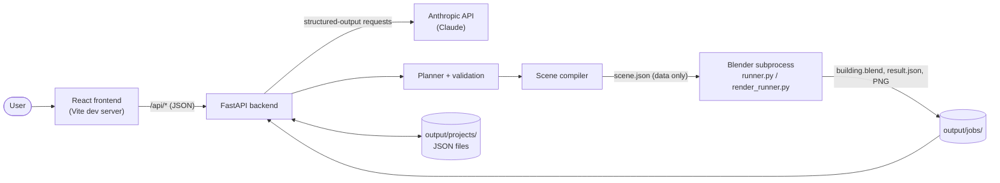
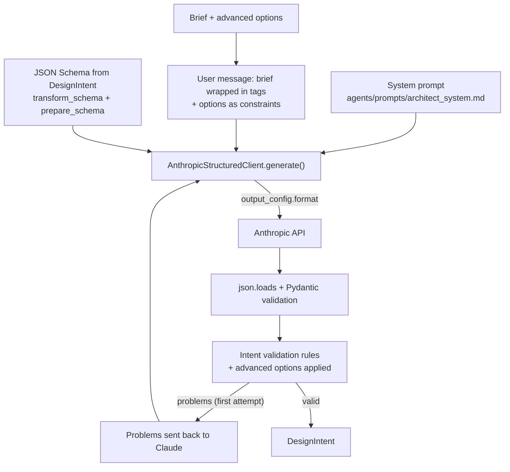
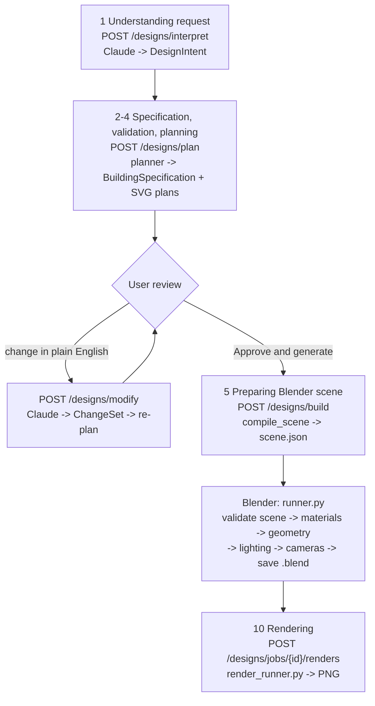
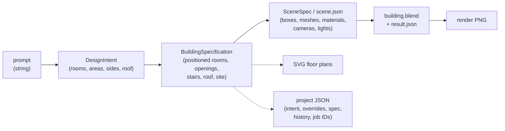
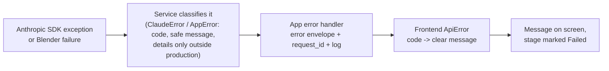

# AI Architect Agent - System Architecture

This document explains how AI Architect Agent works internally. For endpoint-level details see [API Documentation](API_DOCUMENTATION.md); for installation see [Installation Guide](INSTRUCTION.md); for security see [Security](SECURITY.md); for an evaluation of these choices see [Project Review](PROJECT_REVIEW.md). Deeper design notes live in [docs/](docs/architecture.md).

---

## 1. Architecture Overview

The system is a local web application with three runtimes:

1. **A React frontend** (Vite, TypeScript) that collects the brief, shows the review and drives each step.
2. **A FastAPI backend** (Python) that calls Claude, plans and validates the building, compiles it into data for Blender, manages builds, renders and saved projects.
3. **Blender**, started by the backend as a separate process for each build or render, running the project's own scripts.

The guiding principle is a narrow use of AI. Claude does one thing: turn language into a structured, schema-constrained design intent (and, for changes, a list of typed operations). Everything after that is deterministic Python that can be tested: the planner, the validator, the scene compiler and the Blender scripts. Blender never runs code produced by Claude or by the backend; it receives a data file and builds only what that data describes.

## 2. High-Level Architecture Diagram



## 3. Frontend Architecture

| Aspect | Implementation |
| --- | --- |
| Framework | React 19 with TypeScript, built by Vite 8; Tailwind CSS 4 for styling |
| Entry | `frontend/src/main.tsx` renders `App.tsx` |
| State | Plain React state in custom hooks; no global store |
| API client | `frontend/src/services/api.ts`: one `request()` function with per-call timeouts, the error envelope turned into an `ApiError`, and Claude error codes translated by `utils/errorMessages.ts` |
| Development proxy | `vite.config.ts` forwards `/api` to `BACKEND_URL` (default `http://127.0.0.1:8000`) |

Hooks hold each part of the workflow:

| Hook | Responsibility |
| --- | --- |
| `useHealth` | Backend health and configuration |
| `useInterpretation` | Interpret, then plan; plain-English changes; restoring a saved project |
| `useBuild` | Blender build |
| `useRenders` | Renders and the automatic preview after each build |
| `useProjects` | Project list, save (with version), delete |

Components follow the screen's three columns: the brief (`PromptPanel`, `AdvancedOptions`, `ProjectsPanel`), the work area (`PlanSheet` when empty, then `DesignReview` with `SaveBar`, `FloorPlans`, `ModifyPanel`, `ValidationPanel`, `RenderPanel`), and status (`SystemStatus`, `PipelineStages`).

**Generation status.** `PipelineStages` shows ten stages. Their state comes from the requests: a stage is *in progress* while the request that performs it is pending and *complete* when that request's response lists it in `completed_stages`. There is no streaming of progress from the backend.

**Timeouts** in the API client: 8 seconds by default; 3 minutes for interpretation and changes; 30 seconds for planning; 10 minutes for builds; 30 minutes for renders.

## 4. Backend Architecture

```
app/main.py app factory: logging, middleware, CORS, error handlers, routers
app/core/ settings (pydantic-settings), logging, request-ID and body-size middleware, error envelope
app/api/routes/ HTTP layer: health, specifications, examples, designs, projects
app/schemas/ request and response models for the HTTP layer
app/agents/ ArchitectAgent, ModificationAgent and their system prompts
app/services/ Claude client, Blender build and render services, examples, summaries
app/models/ domain models: BuildingSpecification, DesignIntent, rooms, openings, stairs, roof...
app/validation/ validation engine, rules, safe automatic fixes
app/planner/ deterministic floor planner, layout anchoring, SVG plans
app/modification/ ChangeSets, applying changes, describing differences
app/scene/ scene compiler: walls, openings, stairs, roof, landscape, cameras, lighting
app/geometry/ rectangles, segments, opening placement, stair and roof maths
app/projects/ saved-project models and the JSON repository
```

Routes are thin: they validate input with Pydantic, call a service or agent, and shape the response. Services that need configuration are created per request from `Settings` through FastAPI dependencies, which lets tests substitute fakes.

## 5. Claude Service Architecture



- **One request path.** `AnthropicStructuredClient` (`app/services/claude_service.py`) is the only code that calls the SDK. `_create()` builds every request; `classify()` turns every SDK exception into a stable `CLAUDE_*` code; failures are logged with HTTP status, Anthropic error type, request ID and message, never the key.
- **Structured outputs.** Interpretation and modification send the schema in `output_config.format`, so replies are constrained to it. Schemas come from the Pydantic models through the SDK's `transform_schema` and are checked at import by `prepare_schema` against what structured outputs accept.
- **Fallbacks.** If Anthropic rejects `cache_control`, the request is retried without prompt caching and caching is switched off for the process. If it rejects the schema itself, the request is retried with the schema in the instructions and no `output_config` (JSON-only), remembered per schema. Account, key, model, permission, connection and rate-limit errors never fall back.
- **Correction loop.** The agents (`ArchitectAgent`, `ModificationAgent`) validate every reply and send specific problems back once (`ARCHITECT_MAX_ATTEMPTS`, default 2).
- **Health check.** `check()` sends a tiny text request and a tiny structured request; `GET /api/health/claude` caches the result for 10 minutes.

## 6. Generation Pipeline



Inside Blender the order is: create collections, **materials**, geometry (walls, slabs, floors, doors, windows, stairs, balconies, roof, site and planting), world and lights, cameras, view layers, save. The frontend lists *Generating geometry* before *Applying materials*; both are completed by the same response.

## 7. Data Flow



Each arrow is a pure function or a validated hand-over, which keeps every stage testable on its own: `DesignIntent` (Claude's output, validated) -> `plan_building()` -> `BuildingSpecification` (validated) -> `compile_scene()` -> `SceneSpec` (validated again by Blender) -> Blender objects.

## 8. Architectural Data Model

| Entity | Model | Notes |
| --- | --- | --- |
| Design intent | `DesignIntent` (`app/models/intent.py`) | What Claude produces: rooms with target areas and preferred sides, connections, stairs, roof, exterior, site |
| Building | `BuildingSpecification` (`app/models/building.py`) | Schema version `1.0`; the single source of truth |
| Floor | `Floor` | Level, elevation, height |
| Room | `Room` (`app/models/room.py`) | 19 room types; axis-aligned rectangle on one floor; finishes |
| Door, window, balcony | `app/models/opening.py` | Positioned on room edges by offset and width |
| Stair | `Stair` (`app/models/stairs.py`) | Footprint, direction, risers, rise, run |
| Roof | `Roof` (`app/models/roof.py`) | Flat, gable, hip or shed; pitch, overhang, ridge direction |
| Materials | `MaterialRef` (`app/models/materials.py`) | One of 19 material IDs, optionally with a colour |
| Site | `Environment` (`app/models/environment.py`) | Ground, driveway, paths, patio, vegetation, sun |
| Scene | `SceneSpec` (`app/scene/model.py`) | Elements, materials, collections, cameras, lights, worlds, view layers |
| Change | `ChangeSet` and typed operations (`app/modification/changeset.py`) | Claude's reply to a change request |
| Project | `Project` (`app/projects/model.py`) | Saved state plus server-derived paths and report |

## 9. Blender Architecture

`BlenderService` (`app/services/blender_service.py`) creates a job folder, writes `scene.json` and runs:

```
<blender> --background --factory-startup --python blender/scripts/runner.py -- <job_dir>     (binary mode)
<python-with-bpy> blender/scripts/runner.py -- <job_dir>                                      (python mode)
```

Inside Blender:

| Script | Role |
| --- | --- |
| `runner.py` | Entry point: reads and validates the scene, builds it, saves `building.blend`, writes `result.json` with every object's bounds, material and mesh checks |
| `scene_validation.py` | Re-validates the scene: allowed element kinds, names, finite bounded numbers, mesh indices, size limits (`MAX_ELEMENTS` 20,000, `MAX_BOXES` 400 per element, `MAX_VERTICES` 5,000, coordinates within ±1,000 m) |
| `scene_builder.py` | Collections, then materials, then dispatch to the generators, then lighting, cameras and view layers |
| `mesh_utils.py` | Turns boxes or explicit meshes into Blender mesh objects |
| `wall_generator.py`, `floor_generator.py`, `door_generator.py`, `window_generator.py`, `stair_generator.py`, `balcony_generator.py`, `roof_generator.py`, `ground_generator.py`, `environment_generator.py` | One generator per element kind |
| `material_generator.py`, `material_nodes.py` | Procedural material recipes and shared texture coordinates |
| `lighting_generator.py`, `lighting_presets.py` | Worlds, sun and interior lights; switching presets |
| `camera_generator.py` | Cameras from the compiled positions |
| `render_runner.py`, `render_settings.py` | Rendering, with its own request validation |

All geometry is computed by the backend's scene compiler (`app/scene/`); the Blender scripts only create what the data describes.

## 10. Geometry Generation

The algorithms are deliberately simple and exact:

- **Layout.** The planner (`app/planner/`) places a full-depth hall ("spine") with one or two columns of rooms beside it, on a rectangular footprint. It searches spine positions in 0.1 m steps, scoring each layout with a cost function (area error, proportions, stranded rooms), then places doors, windows, balconies and the site. A modified design reuses the previous arrangement (`app/planner/anchor.py`).
- **Walls.** Wall runs are derived from shared room edges and the footprint; exterior walls are 0.3 m and interior walls 0.1 m thick. Each run is split into solid pieces around its openings (full-height pieces between openings, a lintel above, a sill wall below windows): no boolean operations.
- **Stairs** are one solid block per tread; the slab above and the landing floor get a matching stairwell opening.
- **Roofs** are closed meshes: a slab for flat roofs, hand-built vertex and face lists for gable, hip and shed roofs, with gable-end infill.
- **Checks.** Tests check that no two solid boxes overlap, that every opening is clear and that every mesh is closed with outward normals, both in Python and inside Blender.

## 11. Material System

Each material in the scene names a **recipe** (one of 19 material IDs: brick, white render, concrete, timber cladding, slate, clay tile, standing-seam metal, glass, and so on) and a base colour, which carries any colour override from the specification. `material_generator.py` builds a node tree for each recipe from Blender texture nodes; no image files are used. A shared node group, `AIARCH_WorldUV`, projects world-space position onto each face, so brick courses continue across separate wall pieces at true scale. Planting uses two scene-only recipes, foliage and bark, which are not offered to Claude.

## 12. Lighting System

The scene compiler produces two presets:

- **Day:** a sun from the specification's sun direction and a sky matching its sky type.
- **Evening:** a low warm sun and a dusk sky, with interior lights brighter.

Each room gets ceiling area lights sized to its floor area; garages are left unlit. Presets are separate worlds and light collections (`LIGHTS_DAY`, `LIGHTS_EVENING`, `LIGHTS_INTERIOR`); `lighting_presets.apply_preset()` switches between them. The sky is built from basic nodes so it looks the same in Blender 4 and 5.

## 13. Camera System

Cameras are computed by the backend (`app/scene/cameras.py`):

- **Exterior** (front, rear, aerial): perspective cameras placed by bisecting the distance until the whole building fills at most 88% of the frame.
- **Interior** (living room, kitchen, master bedroom, where those rooms exist): in the corner opposite the main windows, at eye height.
- **Floor plans** (one per floor): orthographic, from above, each with its own view layer that hides the roof, the floors above and that floor's ceiling. Each plan camera records its view layer in `aiarch_view_layer`.

## 14. Rendering Pipeline

`RenderService` (`app/services/render_service.py`) checks the camera exists, chooses the engine, writes a request file and runs `render_runner.py`, which:

1. opens `building.blend` and validates the request against its own whitelists;
2. applies the lighting preset and selects the camera;
3. enables exactly one view layer (the camera's floor-plan layer, or the main layer);
4. renders to `renders/<render_id>.png` and rejects blank images.

| Quality | Cycles samples | EEVEE samples | Resolution scale |
| --- | --- | --- | --- |
| Preview | 16 | 16 | 50% |
| Standard | 64 | 64 | 100% |
| High | 256 | 128 | 100% |

Resolutions are 1280 x 720, 1920 x 1080 and 2560 x 1440. With `auto`, a one-off test render decides the engine for the process: Cycles if EEVEE fails or Blender reports a software OpenGL renderer (such as llvmpipe), otherwise EEVEE unless it is more than 1.5 times slower than Cycles.

## 15. Project Storage

**There is no database.** Saved projects are JSON files in `output/projects/<id>.json`, managed by `JsonProjectRepository` behind the `ProjectRepository` protocol (`app/projects/repository.py`):

- writes go to a temporary file renamed into place (atomic on the same filesystem);
- every save carries the version it was based on, and a stale save returns `409 project_changed`;
- the server validates the specification itself and derives every file path and URL from IDs;
- a damaged file is skipped in the list rather than hiding the others.

Builds and renders live in `output/jobs/<job_id>/`. Nothing is deleted automatically.

## 16. Configuration Architecture

`Settings` (`app/core/config.py`, pydantic-settings) reads environment variables and the `.env` file in the project root, with typed defaults and bounds. Settings are read once at start-up. Blank storage directories fall back to their defaults. The frontend has one setting of its own, `BACKEND_URL`, read by `vite.config.ts`. Every setting is listed in `.env.example` and in the [Installation Guide](INSTRUCTION.md#6-environment-configuration); a test fails if the two drift apart.

## 17. Error Handling Architecture



Unexpected exceptions become `500 internal_error` with no details in the response; the traceback goes to the server log with the request ID.

## 18. Async / Concurrency Model

- **No background jobs or queue.** Every operation runs within its HTTP request.
- `interpret` and `modify` are `async` and await the Anthropic SDK's async client.
- `plan`, `build`, `render` and the project routes are synchronous functions, which FastAPI runs in its thread pool. Builds and renders call `subprocess.run`, blocking that thread until Blender finishes or times out.
- Several builds or renders can therefore run at once, each its own Blender process, limited only by the thread pool and the machine.
- **In-process state:** the engine choice for rendering, the Claude verification result and the set of schemas needing the JSON-only path are cached in module-level dictionaries; they reset when the backend restarts and are not shared between processes.
- Project saves are serialised by a `threading.Lock`, which protects one process only.

## 19. External Dependencies

| Dependency | Role |
| --- | --- |
| FastAPI, Uvicorn | HTTP API and server |
| Pydantic v2, pydantic-settings | Models, validation, settings |
| Anthropic Python SDK | Claude requests and structured outputs |
| Blender (or the `bpy` module) | Building, saving and rendering scenes |
| React, React DOM | User interface |
| Vite, TypeScript, Tailwind CSS | Frontend build, typing, styling |
| pytest, pytest-asyncio, httpx, Ruff | Backend tests and lint |
| Vitest, Testing Library | Frontend tests |
| `@sparticuz/chromium`, puppeteer-core, axe-core | `tools/visual-check` only |

## 20. Design Decisions

| Decision | Reason visible in the code |
| --- | --- |
| Claude produces data, never code | Only data crosses into Blender, re-validated there; AI output cannot execute anything |
| Structured outputs plus Pydantic plus rules | Three layers of checking before a design is accepted |
| Deterministic planner | The same intent always produces the same plan; layouts are testable |
| Review before build | Nothing is built until the user approves |
| Specification as the single source of truth | Plans, scene, project storage and changes all derive from it |
| Intent plus overrides for changes | Layout changes re-plan; finishing changes survive re-plans |
| Blender as a subprocess | Isolation, timeouts, version independence; the backend never imports `bpy` |
| Files, not a database | Simple local use; storage behind a repository interface |

## 21. Current Architectural Limitations

- Requests block until the work is done; there is no queue, progress stream or cancellation.
- Rectangular footprints with a central hall only; no L-shaped, curved or multi-wing plans.
- Process-local caches and locks: running several backend processes would duplicate checks and could race on project saves.
- Files under `output/` grow without limit.
- No authentication, accounts or rate limiting (see [Security](SECURITY.md)).
- Modifications rebuild the whole Blender scene rather than patching it (builds take under a second, and unchanged objects keep their names).

## 22. Future Architecture

The following is a **proposal**, not current behaviour, for multi-user or hosted use:

```mermaid
flowchart TD
    W["Web frontend"] --> G["API gateway<br/>(authentication, rate limiting)"]
    G --> API["Backend API"]
    API --> Q[("Job queue")]
    Q --> CW["Claude workers"]
    Q --> BW["Blender workers<br/>(isolated containers)"]
    API --> DB[("Database<br/>projects, users, jobs")]
    BW --> OS[("Object storage<br/>.blend files, renders")]
    API --> OS
```



The existing seams make this incremental: `ProjectRepository` can gain a database implementation, the build and render services already isolate Blender in subprocesses with job folders, and every pipeline step is already a separate request.
