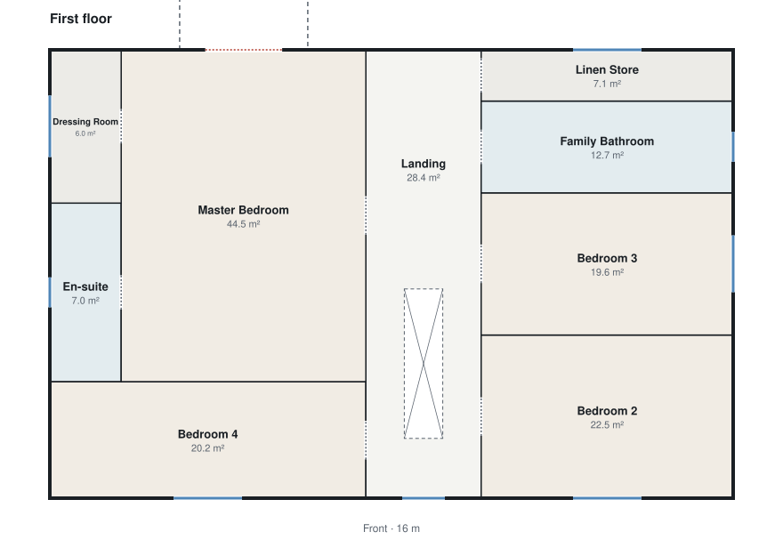
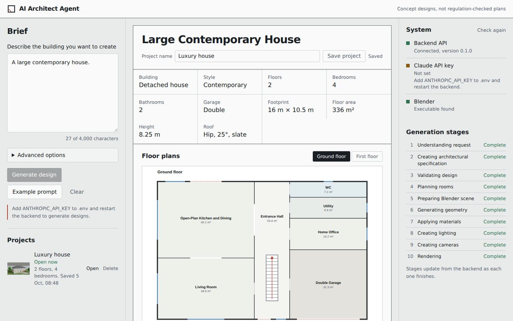
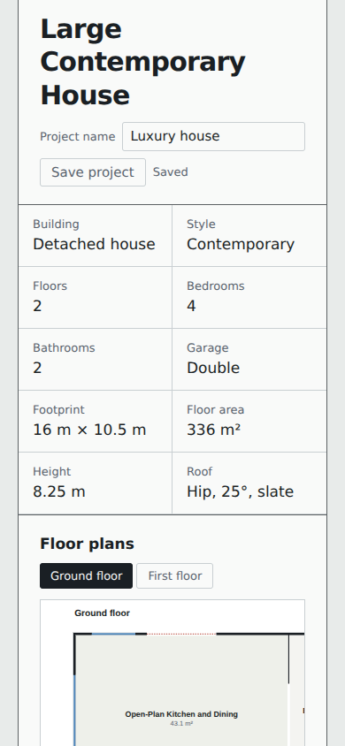
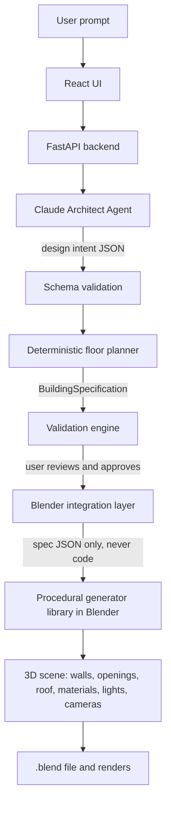

# AI Architect Agent

Describe a building in plain English and get back a structured architectural specification, a validated floor plan and, eventually, a procedurally generated 3D model rendered in Blender.

> Generated buildings are **conceptual designs**. Nothing in this project checks compliance with UK Building Regulations or planning rules.

**Project status: release candidate 1.0.0-rc.1. All 14 phases are complete; see the [changelog](CHANGELOG.md) for what is verified and what is not yet.** Enter a brief: Claude interprets it, a deterministic planner lays it out as a validated building specification with floor plans, and once you approve it, Blender builds the house (walls with door and window openings, doors, windows, stairs, balconies and roof) with procedural materials, its site, cameras and day and evening lighting, saves a `.blend` file and renders a preview. Any camera can then be rendered at higher quality, and the design can be changed in plain English ("make the living room 1 metre wider", "change the roof to a hip roof") without the rest of the house moving. Designs are saved as projects, with their history, build and renders, and can be reopened later. The [roadmap](#roadmap) lists what each phase adds.

<p>
  
  
</p>

*Floor plans produced by the planner for the example luxury house: double garage, open-plan kitchen and living room, central stair with a gallery landing, four bedrooms and a master balcony. Red marks external doors, blue marks windows.*

<p>
  
  
</p>

*The app reviewing a saved design on a laptop and a phone, captured with [the visual check](tools/visual-check). Screenshots were taken where Google Fonts is blocked, so they show the fallback typeface rather than Archivo.*

## How it works

The core idea: **Claude decides *what* should exist; deterministic code decides *where* and *how*.** The AI never writes Blender code. It produces structured data that is validated before any geometry is created.



Modifications ("make the living room 1 m wider") follow the same rule: Claude returns a structured **ChangeSet** against the existing specification, which is validated and applied, and only affected parts of the scene are rebuilt. See [docs/architecture.md](docs/architecture.md) for the full design and the reasoning behind it.

## Technology

| Area | Choice |
| --- | --- |
| Backend | Python 3.11+, FastAPI, Pydantic v2, pydantic-settings, Uvicorn |
| AI | Anthropic Claude API with structured outputs (JSON schema constrained decoding) |
| Frontend | React 19, TypeScript, Vite, Tailwind CSS 4 |
| 3D | Blender (4.2 LTS or newer) driven headlessly with a versioned `bpy` generator library (from Phase 5) |
| Tests | pytest, Vitest, Testing Library |

## Getting started

### Prerequisites

- Python 3.11 or newer
- Node.js 20 or newer
- Blender 4.2 LTS or newer (only needed from Phase 5)

### 1. Configure environment

```bash
cp .env.example .env
```

Edit `.env` in the repository root. Both the backend and the Vite dev server read this one file. The Anthropic key is only ever read by the backend; the browser never sees it.

| Variable | Purpose | Default |
| --- | --- | --- |
| `APP_ENV` | `development`, `test` or `production` | `development` |
| `LOG_LEVEL` | Backend log level | `INFO` |
| `CORS_ORIGINS` | Comma-separated browser origins allowed to call the API | `http://localhost:5173,http://127.0.0.1:5173` |
| `ANTHROPIC_API_KEY` | Claude API key (server-side only) | empty |
| `ANTHROPIC_MODEL` | Claude model used by the agents | `claude-sonnet-5-5` |
| `ANTHROPIC_MAX_TOKENS` | Output limit per Claude call | `8000` |
| `ANTHROPIC_TIMEOUT_SECONDS` | Timeout per Claude call | `120` |
| `ARCHITECT_MAX_ATTEMPTS` | Claude calls per interpretation, including the corrective one | `2` |
| `BLENDER_EXECUTABLE` | Blender application, or a Python with the `bpy` module | empty |
| `BLENDER_MODE` | `auto`, `binary` or `python` | `auto` |
| `BLENDER_TIMEOUT_SECONDS` | Longest a build may run | `300` |
| `PROJECTS_DIR` | Where saved projects are stored | `output/projects` |
| `RENDER_TIMEOUT_SECONDS` | Longest a render may run | `900` |
| `RENDER_DEFAULT_ENGINE` | `auto` (EEVEE with a GPU, otherwise Cycles), `eevee` or `cycles` | `auto` |
| `BACKEND_URL` | Where the Vite dev proxy forwards `/api` | `http://127.0.0.1:8000` |

### 2. Run the backend

```bash
cd backend
python -m venv .venv
source .venv/bin/activate # Windows: .venv\Scripts\activate
pip install -r ../requirements-dev.txt
uvicorn app.main:app --reload
```

The API runs on http://127.0.0.1:8000. Interactive API docs are at http://127.0.0.1:8000/api/docs.

### 3. Run the frontend

In a second terminal:

```bash
cd frontend
npm install
npm run dev
```

Open http://localhost:5173. The System panel on the right shows live status from the backend: whether the API is reachable, whether a Claude key is configured and whether Blender has been found.

If generating a design fails with a Claude error, the app shows the cause (for example `CLAUDE_BILLING_ERROR`: the account has no API credit). For a full diagnosis, run `python -m scripts.check_claude` in `backend` with the virtual environment active: it tests a plain request, prompt caching, structured outputs with a tiny schema and with both of the app's schemas, step by step, stopping at the first failure with Anthropic's own explanation. **Verify** in the System panel runs the same quick check from the app.

### 4. Connect Blender

Set `BLENDER_EXECUTABLE` in `.env` to a Blender application (4.2 LTS or newer) or to a Python 3.13 interpreter with `pip install bpy`, then restart the backend. The System panel confirms Blender was found, and **Approve and generate** builds the reviewed design and offers the `.blend` file for download. Builds are saved under `output/jobs/`. See [docs/blender-integration.md](docs/blender-integration.md).

## API

| Method | Path | Description |
| --- | --- | --- |
| `GET` | `/api/health/claude` | Prove Anthropic accepts requests: a tiny text request and a tiny structured-output request, cached for 10 minutes (`?refresh=true` to check again) |
| `GET` | `/api/health` | Service status, version and configuration checks. Never returns secrets or file paths. |
| `POST` | `/api/designs/interpret` | Interpret a brief (plus optional advanced options) into a validated `DesignIntent` |
| `POST` | `/api/designs/plan` | Lay out a `DesignIntent` as a validated `BuildingSpecification`, with an SVG floor plan per floor. No API key needed. |
| `POST` | `/api/designs/build` | Validate a specification and build it in Blender; returns the job and a download link |
| `GET` | `/api/designs/jobs/{job_id}/building.blend` | Download the `.blend` file a build produced |
| `POST` | `/api/designs/jobs/{job_id}/renders` | Render one image: camera, day or evening, quality, resolution, engine (all from fixed lists) |
| `GET` | `/api/designs/jobs/{job_id}/renders/{render_id}.png` | Download a render |
| `GET` | `/api/specifications/schema` | JSON Schema of `BuildingSpecification` |
| `POST` | `/api/designs/modify` | Apply a plain-English change to the current design; returns the updated design and a list of what changed |
| `GET` | `/api/projects` | Saved projects, newest first |
| `POST` | `/api/projects` | Save a new project |
| `GET` | `/api/projects/{id}` | Open a project (with its floor plans and build and render status) |
| `PUT` | `/api/projects/{id}` | Save again; include the `version` you opened, or get `409` if it changed since |
| `DELETE` | `/api/projects/{id}` | Delete a project (its build and render files are kept) |
| `POST` | `/api/specifications/validate` | Validate a specification: PASS, WARNING or ERROR, every issue, every automatic fix, and a summary |
| `GET` | `/api/examples` | The example prompts |
| `GET` | `/api/examples/{id}` | One example prompt with its full specification |

Request bodies are limited to 1 MB (`413 request_too_large`).

Every error uses one envelope, and every response carries an `X-Request-ID` header that matches the backend log line:

```json
{ "error": { "code": "not_found", "message": "Not Found", "request_id": "4ed664eb..." } }
```

## How Claude is used

The Architect Agent sends the brief to Claude with a JSON schema as a structured output, so the reply is always a `DesignIntent` object rather than prose. Claude decides what the building needs (rooms, target areas, which rooms connect, stairs, footprint, roof, materials) and states the assumptions it made. It does not produce coordinates or code.

Every reply is then checked in code: types and ranges with Pydantic, then design rules (every room reachable from the entrance, stairs between every floor, room areas that fit the footprint, and any bedroom, bathroom or garage counts the user fixed in Advanced options). Problems are sent back to Claude once for a corrected design; if they persist, the user gets a clear error listing them. Details are in [docs/agents.md](docs/agents.md).

To try it without the UI:

```bash
cd backend
python -m scripts.interpret_brief "A modern three-bedroom bungalow with a flat roof"
```

## How rooms are placed

Claude's design intent contains no coordinates. A deterministic planner places every room: a hall and landing run front to rear and hold the stairs, and rooms stack in columns either side, so every room can be reached from the hall and has an exterior wall for windows. The planner searches spine positions and stair arrangements, scoring each for how closely rooms match Claude's requested sizes, how well proportioned they are, and whether the stairs leave every room a door. Doors, windows, balconies, the driveway and the patio follow, then the full validator runs.

Every compromise is reported ("Utility is 9.9 m², larger than the 7 m² requested, to fit the footprint"). Details, including how 300 randomly generated briefs are tested, are in [docs/planner.md](docs/planner.md).

```bash
cd backend
python -m scripts.interpret_brief --example british-family-house --plan output/plans # needs an API key
```

## How the 3D model is built

The approved specification is validated again, then compiled into a scene description: named boxes for walls, slabs and floors, organised into collections. Walls are cut around door and window openings, frames and glass fill them, stairs rise through stairwells cut in the slab above, and roofs are closed meshes with gable infill. All 19 materials (brick, timber cladding, slate, glass and so on) are procedural node setups with no image files, using world-space texture coordinates so brick courses line up across every wall piece. This is data only. Blender runs as a separate process with this repository's runner, which accepts only known element kinds and plain values and builds them with fixed generator functions. Nothing Claude produces is ever executed. The result is an editable scene with meaningful names (`Wall_GroundFloor_Front_01`, `Room_MasterBedroom`) and collections per floor.

## Changing a design

Once a design has a floor plan, describe a change and the Modification Agent turns it into typed operations on the existing design: resize, add, remove or move rooms, change the roof, materials or colours, add or remove windows and balconies. The previous arrangement is kept, so only what the change needs moves; every operation's effect is verified; and the app lists exactly what changed. Details in [docs/agents.md](docs/agents.md#modification-agent).

## Saving projects

Save a design from the review screen and reopen it from the Projects list: the brief, Claude's interpretation, the current design (intent, overrides and specification), the change history, and the latest build and renders come back as they were. Each project is one JSON file under `output/projects/`, written atomically. Saving over a version someone else saved since is refused with a clear message rather than overwriting it. The server re-validates every saved design and derives every file path itself, so a saved project cannot point at arbitrary files; storage sits behind a small repository interface so a database can replace the JSON files later. See [docs/architecture.md](docs/architecture.md#data-and-storage).

## Rendering

Every build is followed by a preview render of the front of the house. The review screen then offers any of the generated cameras (exterior front, rear and aerial, interiors, floor plans), day or evening lighting, three quality levels and three resolutions. EEVEE is used where the machine has a GPU and Cycles otherwise; the choice is measured once, and explained in the app when it isn't EEVEE. See [docs/blender-integration.md](docs/blender-integration.md#rendering).

## Building specification and validation

Every design is described by a typed `BuildingSpecification`: floors, rooms, doors, windows, stairs, balconies, roof, materials and site, all in metres with the origin at the front-left corner of the footprint. Before anything is built, a deterministic validation engine checks it, covering overlapping rooms, doors that don't sit on a shared wall, windows on interior walls, unreachable rooms, stairs that don't match floor heights, impossible roofs and more. It only auto-corrects small, unambiguous problems, and lists every correction.

```json
{
  "status": "ERROR",
  "issues": [
    { "severity": "error", "code": "room_overlap", "message": "WC overlaps Kitchen / Dining by 1.40 m²." },
    { "severity": "warning", "code": "room_without_window", "message": "Bedroom 2 has no exterior window." }
  ],
  "fixes": [
    { "code": "stair_rise_corrected", "message": "Set stair stair_main rise to 193 mm so its 14 risers exactly match the 2.70 m floor-to-floor height." }
  ]
}
```

The full schema, coordinate system and rule catalogue are in [docs/building-specification.md](docs/building-specification.md).

## Testing

```bash
# Backend: tests, and lint
cd backend && python -m pytest && ruff check app tests scripts ../blender/scripts

# Frontend
cd frontend && npm test && npm run typecheck && npm run build

# Real Blender tests (optional; a Blender application or a Python with bpy)
cd backend && BLENDER_EXECUTABLE=/path/to/blender python -m pytest tests/blender -v

# The whole definition of done over HTTP, with real Blender and a scripted Claude (optional)
cd backend && BLENDER_EXECUTABLE=/path/to/blender python -m pytest tests/e2e -v -s

# Screenshots and an accessibility audit of the running app (optional)
cd tools/visual-check && npm install && npm run check

# Live Claude tests (optional, uses your API key, costs a few cents)
cd backend && RUN_LIVE_CLAUDE_TESTS=1 python -m pytest -m live -v -s
```

GitHub Actions runs both suites and the linter on every push and pull request (`.github/workflows/ci.yml`). The backend suite includes `tests/test_docs.py`, which fails if the API table above, `.env.example` or any path mentioned in the documentation drifts from the code.

## Project structure

```
ai-architect-agent/
├── backend/
│   ├── app/
│   │   ├── main.py # App factory: middleware, CORS, error handlers, routers
│   │   ├── core/ # Settings, logging, request-ID middleware, error envelope
│   │   ├── agents/ # Architect Agent and its system prompt
│   │   ├── api/ # Routers (all under /api)
│   │   ├── models/ # BuildingSpecification and DesignIntent
│   │   ├── planner/ # Deterministic floor planner and SVG plan drawings
│   │   ├── scene/ # Specification to Blender scene description (walls, slabs, names)
│   │   ├── geometry/ # Pure geometry: rectangles, shared walls, stairs, roofs (no bpy)
│   │   ├── validation/ # Deterministic checks for specifications and design intents
│   │   ├── services/ # Claude client, Blender jobs, example repository, summary
│   │   └── schemas/ # API request/response models
│   ├── scripts/ # Example builder, interpret_brief CLI
│   └── tests/
├── frontend/
│   └── src/
│       ├── components/ # Brief, advanced options, design review, floor plans, status, stages
│       ├── hooks/ # useHealth, useInterpretation
│       ├── services/ # Typed API client with error-envelope handling
│       ├── types/ # Types mirroring backend schemas
│       └── utils/
├── blender/scripts/ # Runner and generators executed inside Blender (data in, geometry out)
├── examples/
│   ├── prompts/ # Five example prompts
│   └── specifications/ # Matching validated BuildingSpecifications
├── docs/
│   ├── architecture.md
│   ├── agents.md
│   ├── blender-integration.md
│   ├── building-specification.md
│   └── planner.md
├── .env.example
└── requirements.txt / requirements-dev.txt
```

Folders are added in the phases that fill them, rather than left as empty stubs.

## Accessibility

The interface is audited with [axe-core](https://github.com/dequelabs/axe-core) against WCAG 2 A and AA (including colour contrast) and best practices, on desktop and mobile, empty and with a project open: `tools/visual-check` reports no violations. Controls have labels, status changes are announced with live regions, floor tabs follow the tab pattern, scrollable areas are keyboard-reachable, and motion respects the reduced-motion setting.

## Security

- The Anthropic API key lives only in the backend `.env`, is held as a `SecretStr` and is never logged or returned. Tests assert that it does not appear in API responses, and the frontend build was checked to confirm it cannot reach the browser bundle.
- CORS is restricted to configured origins.
- The brief is treated as untrusted text: it is wrapped in tags it cannot break out of, limited to 4,000 characters, and Claude's reply is only ever parsed and validated, never executed.
- Request bodies are capped at 1 MB, including chunked uploads.
- Example IDs are restricted to lowercase slugs and resolved inside the examples folder only.
- Client-supplied request IDs are accepted only if short and alphanumeric, to prevent log injection.
- Unhandled exceptions return a generic message; details stay in the server log.
- **No AI-generated or user-supplied Python is ever executed in Blender.** Blender receives a validated, data-only scene description and runs only this repository's own generator functions; the runner re-checks every element and rejects unknown kinds, unsafe names and out-of-range numbers. Job IDs are random and validated before any file is served.

## Limitations

- There is no furniture in the Blender scene yet. Renders run while the request waits; on a CPU-only machine a preview takes under a minute and high quality can take many minutes.
- A room's width is set by where the hall runs, so making one room wider takes space from the other side of the house or extends the building; the app lists every room this affects.
- Builds run while the request waits (usually under a second or two); background jobs with live progress come later.
- Every floor fills one rectangular footprint, so smaller upper floors and L-shaped buildings are not yet supported. Rooms are rectangles in two columns either side of the hall, and stairs are straight flights. See [docs/planner.md](docs/planner.md#limitations).
- Footprints are rectangular and rooms are axis-aligned rectangles. L-shaped rooms are modelled as two connected rooms.
- Designs are conceptual and are not checked against building regulations, structural engineering or planning policy.

## Roadmap

1. **Foundation**: repository, FastAPI, React, configuration, health checks, tests (done)
2. **Building schema**: Pydantic models, example specifications, validation engine (done)
3. **Claude Architect Agent**: brief to validated design intent, review screen (done)
4. **Deterministic floor planner**: layout search, doors, windows, stairs, site, plan drawings (done)
5. **Basic Blender connection**: ground, slabs, exterior and interior walls, verified in real Blender (done)
6. **Architectural geometry**: openings, doors, windows, stairs, stairwells, balconies, four roof types (done)
7. **Procedural materials**: 19 node-based materials, no image textures, verified in Blender 4.2 and 5.2 (done)
8. **Environment**: driveway, paths, patio, deterministic low-poly planting (done)
9. **Cameras and lighting**: fitted exterior, interior and floor-plan cameras, day and evening presets (done)
10. **Rendering**: whitelisted render options, EEVEE or Cycles chosen by measurement, gallery in the app (done)
11. **Modification agent**: ChangeSets of typed operations, intent and overrides, anchored re-planning, verified effects (done)
12. **Save and load**: JSON project files behind a repository interface, atomic writes, version conflicts, restore in the app (done)
13. **Interface polish**: validation viewer, mobile layout, zero axe-core violations, screenshot tool (done)
14. **Release**: Ruff lint, documentation drift tests, end-to-end definition-of-done test, changelog (done)

## Licence

MIT. See [LICENSE](LICENSE).
