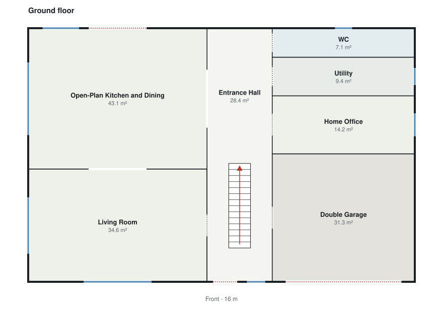

# Floor planner

`backend/app/planner/` turns a `DesignIntent` (what Claude understood) into a complete `BuildingSpecification` (where everything is). It is deterministic: the same intent always produces the same building, and no AI is involved.



## Layout model

Every floor uses the same arrangement, so stairs stack correctly:

```
 rear  ┌──────────┬───────┬──────────┐
       │          │ slot  │          │   spine: the hall (ground floor) or landing,
       │  left    ├───────┤  right   │   running from the front wall towards the rear
       │  column  │ spine │  column  │   and holding the stairs
       │          │  ▤▤▤  │          │   slot: an optional small room behind it
 front └──────────┴───────┴──────────┘   (WC downstairs, bathroom upstairs)
```

Rooms are stacked front to rear in the two side columns, each spanning its column's width. This gives three guarantees by construction:

- Every column room touches the spine, so it can have a door to the hall or landing.
- Every column room touches an exterior side wall, so it can have windows.
- Stairs start in the hall and arrive on the landing directly above.

## Steps

1. **Zoning.** One circulation room per floor becomes the spine (Claude's entrance hall and landing; other corridors are merged into it, with a note). Small rooms reached through only one room (en-suites, dressing rooms, pantries) become *children* of that room and are placed beside it. Rooms joined by an open-plan link stay on the same side.
2. **Search.** The spine's position must be the same on every floor, so it is a building-wide choice. The planner tries every position in 10 cm steps, plus a single-column layout, and for two-storey houses both a stair against one spine wall and a central stair with a passage on each side. Each candidate is laid out completely and scored:
   - **area drift** from Claude's targets, as a squared log ratio (halving a room costs the same as doubling it), weighted by the requested area;
   - **proportion**, penalising rooms more than 2.5 times longer than they are wide;
   - **access**, a heavy penalty for every room whose whole shared wall with the spine would be blocked by a stair.

   The lowest score wins. A full search takes a median of about 20 ms and under 100 ms in the worst case measured.
3. **Columns.** Room depths are shared out in proportion to target area, never below sensible minimums (5 m for a garage, 2.4 m for habitable rooms, 1.2 m for cupboards). Side assignment also checks that each column can hold its rooms' minimum depths.
4. **Stairs.** Rise and run come from `geometry/stairs.py`. Two-storey houses use either a stair against the spine wall that blocks the fewest doors, or a central stair. From three storeys, flights are always central, staggered front to rear when the building is deep enough and otherwise side by side.
5. **Openings.** Doors go on real shared walls, clear of stairs and of each other. Open-plan links become the widest opening that fits. Then come the front door, garage door, patio door (preferring a living space on the rear wall), balconies with their access doors, and windows sized from each room's glazing level.
6. **Access repair.** Every room must be reachable from the front door through the house; patio and garage doors do not count. If a room has no door, one is added through a neighbour, preferring halls and living spaces and avoiding bedrooms, bathrooms, stores and garages wherever possible.
7. **Site.** Driveway in front of the garage, a path to the front door, a patio outside the patio door, and a little planting.
8. **Validation.** The result runs through the full specification validator from Phase 2.

## What the planner reports

The planner never hides compromises. Notes are returned with every plan, for example:

- "Merged Bedroom Corridor into Entrance Hall; the plan uses one circulation space per floor."
- "Utility is 9.9 m² (larger than the 7.0 m² requested) to fit the footprint." (any change over 30%)
- "Kitchen and Dining Room could not be placed side by side, so they are connected through the circulation instead."

When a design cannot be planned, the request fails with `planning_failed` and a specific reason, such as a footprint too shallow for a straight stair.

## How it is tested

| Test | What it checks |
| --- | --- |
| `test_planner_layout.py` | Distribution with minimums, cut points, free-interval placement |
| `test_planner.py` | The five example intents: zero validation errors, determinism, floors tile the footprint exactly, stair placement, en-suite access, openings, garage, patio and balcony doors, error messages, SVG escaping |
| `test_planner_random.py` | 300 generated intents (1-3 storeys, varied footprints and room mixes). Each must plan with zero validation errors and sensible routes, or fail with a clear `PlanningError`. At least 265 of 300 must plan; currently 274 do. |

The **route rule** is stricter than the validator: from the front door, no room may be reached by walking through a bedroom, bathroom, WC, store or garage, except that a small room may open off the one room it serves (an en-suite off its bedroom).

Plans were also reviewed visually during development by rendering them to images. That review found problems the validator passes, which led to the route rule, the access penalty and the central-stair option.

## Limitations

- **One rectangular footprint, filled on every floor.** Upper floors cannot be smaller than the ground floor, and L-shaped buildings are not supported.
- **Two columns of full-width rows.** A floor whose rooms are very uneven (a 58 m² open-plan space and a 6 m² utility) forces small rooms to stretch along a whole column; the notes report it.
- **Straight flights only.** Footprints too shallow for a straight stair are refused.
- About 8% of realistic random intents cannot fit two columns of rooms with their minimum depths and are refused with an explanation.
